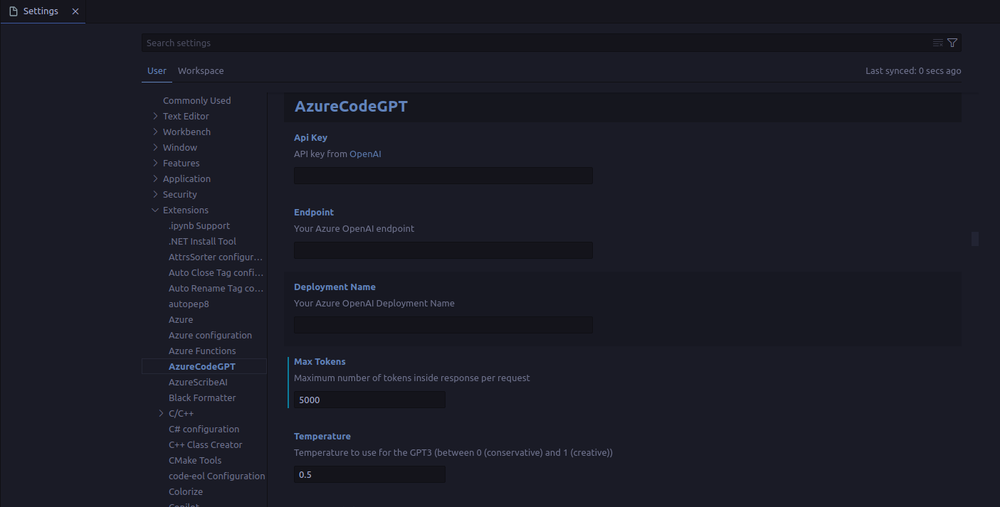

# azurecodegpt-auth: GPT3 and ChatGPT extension for VSCode

This project is a simple fork of <a href="https://github.com/timkmecl/codegpt">CodeGPT</a> that uses Azure OpenAI instead of OpenAI.

This Visual Studio Code extension allows you to use the [official Azure OpenAI Client Library](https://learn.microsoft.com/en-us/javascript/api/overview/azure/openai-readme?view=azure-node-preview) to generate code or natural language responses to your questions from OpenAI's **GPT3** or **ChatGPT**, right within the editor.

Supercharge your coding with AI-powered assistance! Automatically write new code from scratch, ask questions, get explanations, refactor code, find bugs and more 🚀✨ 

### Links:

- **[Visual Studio Marketplace](https://marketplace.visualstudio.com/items?itemName=jeremysemel.azurecodegpt-auth)**
- **[Github Repository](https://github.com/ThePush/azurecodegpt-auth)**

 

# 📢 v2.0 Release

-   Based on the original <a href="https://marketplace.visualstudio.com/items?itemName=timkmecl.codegpt3">CodeGPT</a> v1.1.2
-   I have added the ability to use it with Azure OpenAI.

&nbsp;

# 🌟 Preview

## Features
- 💡 **Ask general questions** or use code snippets from the editor to query GPT3 via an input box in the sidebar
- 🖱️ Right click on a code selection and run one of the context menu **shortcuts**
	- automatically write documentation for your code
	- explain the selected code
	- refactor or optimize it
	- find problems with it
- 💻 View GPT's responses in a panel next to the editor
- 📝 **Insert code snippets** from the AI's response into the active editor by clicking on them

## Installation

To use this extension, install it from the VSCode marketplace.

1. After the installation is complete, you will need to add your Azure OpenAI API key, endpoint and deployment name to the extension settings in VSCode. To do this, open the `Settings` panel by going to the `File` menu and selecting `Preferences`, then `Settings`.
2. In the search bar, type `azurecodegpt-auth` to filter the settings list.
3. In the azurecodegpt-auth section, enter your API key, endpoint and deployment name. You can find these in your Azure OpenAI account.

After completing these steps, the extension should be ready to use.

## Using the Extension

To use the extension, open a text editor in Visual Studio Code and open the azurecodegpt-auth panel by clicking on the azurecodegpt-auth icon in the sidebar. This will open a panel with an input field where you can enter your prompt or question. By clicking enter, it will be sent to GPT3. Its response will be displayed below the input field in the sidebar (note that it may take some time for it to be calculated).

You can also select a code snippet in the editor and then enter a prompt in the side panel, or right-click and select "Ask azurecodegpt-auth". The **selected code will be automatically appended** to your query when it is sent to the AI. This can be useful for generating code snippets or getting explanations for specific pieces of code.

To **insert a code snippet** from the AI's response into the editor, simply click on the code block in the panel. The code will be automatically inserted at the cursor position in the active editor.

You can select some code in the editor, right click on it and choose one of the following **shortcuts** from the context menu:
#### Commands:
- `Ask azurecodegpt-auth`: will provide a prompt for you to enter any query
- `azurecodegpt-auth: Explain selection`: will explain what the selected code does
- `azurecodegpt-auth: Refactor selection`: will try to refactor the selected code
- `azurecodegpt-auth: Find problems`: looks for problems/errors in the selected code, fixes and explains them
- `azurecodegpt-auth: Optimize selection`: tries to optimize the selected code

`Ask azurecodegpt-auth` is also available when nothing is selected. For the other four commands, you can **customize the exact prompt** that will be sent to the AI by editing the extension settings in VSCode Preferences.

